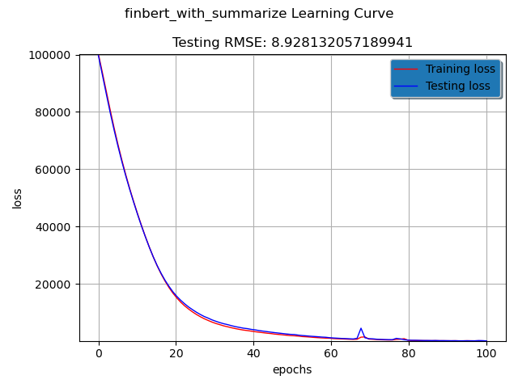
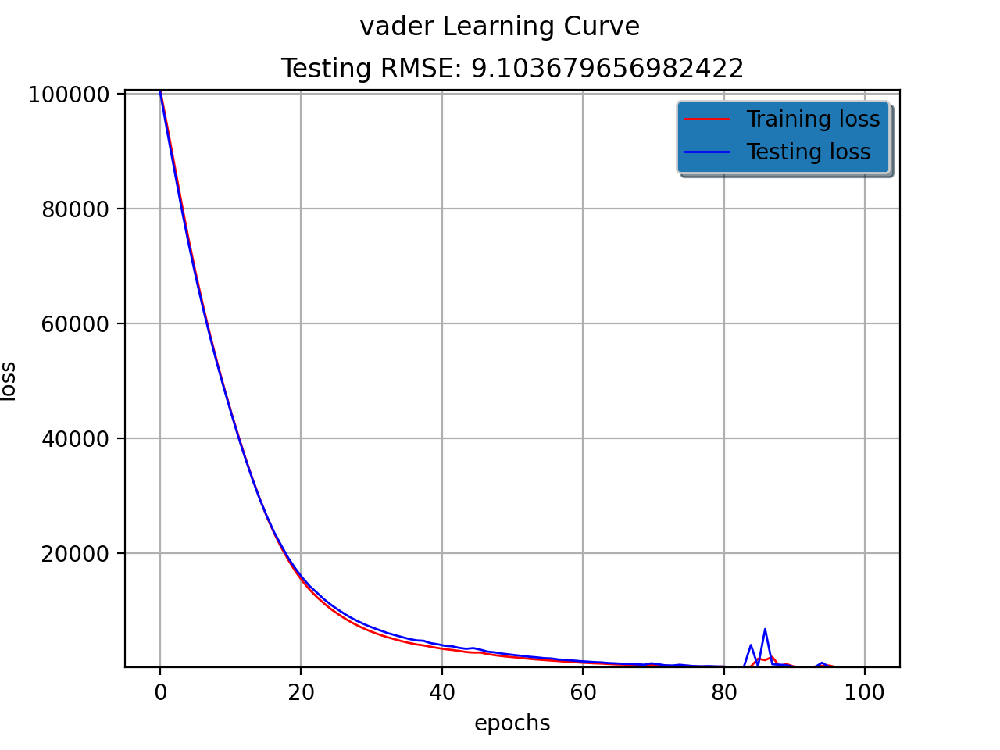
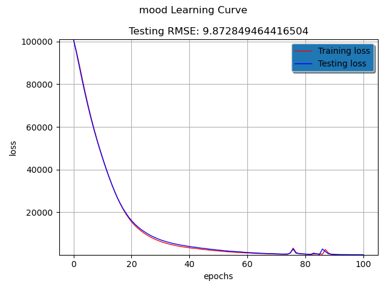

# Word Embedding and Sentiment Analysis Based Stock Prediction

## Introduction:
In this project, we used several word embedding methods on the financial news dataset to create additional features to the prehistorical stock price data set and trained a model to predict the close price at a specific time. The main tools we used are based on a language model called "BERT", i.e Bidirectional Encoder Representations from Transformers. In this project, we will train the model with each of the tools listed below and compare their results. In the end, we will try to ensemble the tools to train a final model.

## Tools:
* [BERT](https://arxiv.org/pdf/1810.04805.pdf)
    * [finBERT](https://github.com/ProsusAI/finBERT)
    * [Sentence Transfermers](https://github.com/UKPLab/sentence-transformers)
* [fasttext](https://fasttext.cc/)
* [NLTK Vader](https://www.nltk.org/_modules/nltk/sentiment/vader.html)
* [Goel and Mittal's Paper](http://cs229.stanford.edu/proj2011/GoelMittal-StockMarketPredictionUsingTwitterSentimentAnalysis.pdf)
* [Software Repository for Accounting and Finance](https://sraf.nd.edu/textual-analysis/)

## Dataset:
* news.json:
it contains news articles from 81 big companies. Each company has an array of articles with field of "title", "text", "pul_time", and "url". Here is an example of "FaceBook":
  ```sh
  {
    "FB": 
        [
            {
                "titles": STRING,
                "url": STRING,
                "text": STRING,
                "pul_time": STRING
            }
        ]
        ...
  }
  ```
* historical_price/[company_name]_2015-12-30_2021-02-21_minute.csv
    They contain minute-level historical prices in the past 5 years for 86 companies. Here is what they look like:
    ```sh
    df = pd.read_csv("historical_price/FB_2015-12-30_2021-02-21_minute.csv")
    print(df.head(5))
    
       Unnamed: 0      v        vw  ...       l                    t    n
    0      945359  200.0  107.1000  ...  107.10  2015-12-30 09:24:00  2.0
    1      945358  130.0  106.8500  ...  106.85  2015-12-30 10:20:00  2.0
    2      945357  286.0  106.8308  ...  106.80  2015-12-30 10:30:00  4.0
    3      945356  100.0  106.8700  ...  106.87  2015-12-30 11:52:00  1.0
    4      945355  200.0  106.9900  ...  106.99  2015-12-30 11:58:00  1.0
    ```
## Data Preparation:
* We formed time series data using only closing price column. Because the size of prehistorical price is too big while the articles are too sparse, we decide to extract the first closing price of a day. We then form time series data and formulate the problem as a regression: use the previous 30 days of data to predict the next days closing price. 
```sh
def combine_prices():
    directory = os.path.join("./historical_price/")
    all_files = glob.glob(directory + "*")
    combined_prices = open('combined_prices.csv','a')
    isHeader = True
    headers = ""
    for file in all_files:
        temp = pd.read_csv(file)
        temp['company'] = file.split('\\')[-1].split('_')[0]
        temp = temp.drop(temp.columns[0], axis=1)
        headers = temp.columns
        temp['t'] = temp['t'].apply(lambda x : x[:10])
        dates = temp['t'].unique()
        filtered_data = []
        for date in dates:
            prices_of_date = temp[(temp.t == date)]
            prices_of_date = prices_of_date.sample(n=50 if len(prices_of_date) > 50 else len(prices_of_date), random_state=0)
            filtered_data.append(prices_of_date)
        temp = pd.concat(filtered_data).reset_index(drop=True)
        print(temp.head)
        temp.to_csv('temp.csv')
        with open('temp.csv', 'r') as f:
            for line in f:
                if isHeader:
                    isHeader = False
                    continue
                combined_prices.write(line)
            isHeader = True
    combined_prices.close()
   ```
## Prerequisites
* 1 Install [finBERT](https://github.com/ProsusAI/finBERT) as the reository suggested. Specifically, you need the model downloaded from this link: [model's link](https://huggingface.co/ProsusAI/finbert)
* 2 Install [Sentence Transformers](https://github.com/UKPLab/sentence-transformers).
* 3 Vader. Install nltk
``` sh
 pip install nltk
```
* 4 [fasttext](https://fasttext.cc). Specifically, you need the model: wiki-news-300d-1M.vec.zip from this [link](https://fasttext.cc/docs/en/english-vectors.html)
* 5 gensim
``` sh
pip install gensim
```
* 6 [SRAF: Loughran-McDonald Sentiment Word Lists](https://sraf.nd.edu/textual-analysis/resources/)
## [finBERT](https://github.com/ProsusAI/finBERT)
#### Setup
* We start off by cloning the repo into a local directory and create a the corresponding conda environment with the necessary
packages. The conda command is:
   ```sh
        conda env create -f environment.yml
   ```
  In our case, we don't need to create a flask server and only need the main functionality of predicting. 
* We use the pretrained model provided by the team([link](https://huggingface.co/ProsusAI/finbert)). Make sure to have the
correct directory setup. Our current setup put the model under /models/classifier_model/finbert-sentiment. 
#### Running run_finbert.py(./src/finbert)
* Make sure to import AutoModelForSequenceClassification from transformers. It differs from the Prosus repo's old example
 since they just started migrating to transformers. Then again make sure you have the correct directory for the model.
 To calculate a set of sentiment-related scores for each piece of news, we did it like this:
     ```sh
     temp = {}
            if article['pub_time'][:10] in finbertJSON.keys():
                temp = finbertJSON[article['pub_time'][:10]]
            article_arr = []
            if company in temp.keys():
                article_arr = temp[company]
            a = {'positive' : 0, 'negative' : 0, 'neutral' : 0, 'sentiment_score' : 0}
            text = article['text']
            text = text.replace('\t', '')
            text = text.replace('\0', '')
            if summarize:
                text = text_summarization.summarize(text)
            finbert_score = predict(text=text, model=model, write_to_csv=False, path=None)
            print(finbert_score)
            if len(finbert_score) != 0:
                logit_avg = finbert_score['logit'].sum()/len(finbert_score)
                a['positive'] = logit_avg[0].item()
                a['negative'] = logit_avg[1].item()
                a['neutral'] = logit_avg[2].item()
                a['sentiment_score'] = (finbert_score['sentiment_score'].sum()/len(finbert_score)).item()
            f = {}
            f['finbert'] = a
            article_arr.append(f)
            temp[company] = article_arr
            #add more features here
            finbertJSON[article['pub_time'][:10]] = temp
     ```
#### The finBERT predictions
* The prediction contains the corresponding sentence, the logit(positive, neutral or negative), prediction and sentiment_score.
We extract the logits for each category and we extract the score. the final finbert.json file is in the following format. 
Each company may have multiple articles so we take the average of the scores
for each company on each day.
  ```sh
    {
        "2016-01-28": {
            "FB": [
                {
                    "finbert": {
                        "negative": FLOAT,
                        "neutral": FLOAT,
                        "positive": FLOAT,
                        "sentiment_score": FLOAT
                    }
                }
            ]
        }
    }
  ```
#### finBERT result:

## [Sentence Transformers](https://www.sbert.net/)
* We mainly used the sentence_transformers, along with [LexRank](https://www.aaai.org/Papers/JAIR/Vol22/JAIR-2214.pdf)
 for summarizing the news articles, as shown on their [repo](https://github.com/UKPLab/sentence-transformers/blob/master/examples/applications/text-summarization/text-summarization.py).
 Since the articles can contain noise and finbert can be quite slow, we rank each article's content by centrality_scores
  in the following way and we take the top five sentences:
    ```sh
     #Compute the sentence embeddings
    embeddings = model.encode(sentences, convert_to_tensor=True)
  
    #Compute the pair-wise cosine similarities
    cos_scores = util.pytorch_cos_sim(embeddings, embeddings).numpy()
  
    #Compute the centrality for each sentence
    centrality_scores = degree_centrality_scores(cos_scores, threshold=None)
  
    #We argsort so that the first element is the sentence with the highest score
    most_central_sentence_indices = np.argsort(-centrality_scores)
    summarization = ""
    for idx in most_central_sentence_indices[0:5]:
        summarization += sentences[idx]
    return summarization
    ```
#### Sentence Transformers + finBERT result:

## [NLTK Vader](https://www.nltk.org/_modules/nltk/sentiment/vader.html)
* Vader is one of NLTK's sentiment analysis library and it is quite straight forward to use. It contains 4 scores, negative,
neutral, positive and compound. We simply store the scores in the same fashion as we did for finbert.
    ````
        {
            "2016-01-28": {
                "FB": [
                    {
                        "vader": {
                            "compound": FLOAT,
                            "neg": FLOAT,
                            "neu": FLOAT,
                            "pos": FLOAT
                        }
                    }
                ]
            }
        }
    ````
* The code used to generate this file is ./src/vader/vader.py:
   ```sh
   nltk.download('vader_lexicon')
   sid = SentimentIntensityAnalyzer()

   f = open('news.json')
   data = json.load(f)
   article_sample = data["FB"][0]
   print("Article Sample", json.dumps(article_sample, indent=4, sort_keys=True))

   counter = 0
   date_to_company_to_arrayOfMethodsScores = {}
   for company in data:
       articles_for_company = data[company]
       for article in articles_for_company:
           time = article["pub_time"][:10]
           score = sid.polarity_scores(article["text"])
           if time in date_to_company_to_arrayOfMethodsScores:
               if company in date_to_company_to_arrayOfMethodsScores[time]:
                   date_to_company_to_arrayOfMethodsScores[time][company].append({"vader":score})
               else:
                   date_to_company_to_arrayOfMethodsScores[time][company] = [{"vader":score}]
           else:
               date_to_company_to_arrayOfMethodsScores[time] = {}
               date_to_company_to_arrayOfMethodsScores[time][company] = [{"vader":score}]
           counter += 1
           print("done: ", counter)


   with open('date_to_company_to_vader.json', 'w') as fp:
       json.dump(date_to_company_to_arrayOfMethodsScores, fp, sort_keys=True, indent=4)
   ```
#### NLTK Vader result:


## Goel and Mittal's Paper (Mood Analysis)
#### There are some problems to replicate this paper on our own dataset:
* 1. In the paper, the authors used tweets to analysis public mood, but in our case, the text data are news where it
  could be more difficult to extract than from the tweets since the tone in the news is more official and less casual.
* 2. The number of the news articles (29630 articles across 5 years) is very limited compare to the tweets the authors
  obtained (476 million across 6 months). There is a big chance that there won't be any mood extracted from a given
  day using the authors' method.
  
#### So, we made some adjustments to make this method at least usable on our dataset:
* 1. The author used SentiWordNet and a standard Thesaurus to find the synonyms of the POMS questionnaire and extend their
  word list by adding the synonyms. We chose to use nltk.wordnet and the word vectors model downloaded from fasttext.cc (wiki-news-300d-1M.vec.zip) 
  to extend our word list. Hence, the word list can be bigger so that we can have more matches when calculating the score for a POMS word.
* 2. we combined the news from all companies on a given day to find the moods instead of from individual companies. In this way, we will
  have more texts to extract moods from.
* 3. We find that the word list is still too small, so we used the word vector from fasttext.cc to further extend the word list. For more detial, please   look at the fasttext section.
  
#### Steps (./src/mittal_paper/):
* 1. We find that the POMS mentioned in the paper has evolved from the 65-word questionnaire to a 34-word questionnaire. 
  We then generated the synonyms of the words in the 34-word questionnaire by using the nltk wordnet as following:
  ``` sh
  POMS_34_words_to_cat = {
    "tense": "ANX",
    "Angry": "ANG",
    "worn-out": "FAT",
    ...
  }
  syn_to_POMS = {}
  for word in POMS_34_words_to_cat:
    for ss in wordnet.synsets(word):
        for name in ss.lemma_names():
            if name not in syn_to_POMS:
                syn_to_POMS[name] = word

   with open('syn_to_POMS_wordnet.json', 'w') as fp:
       json.dump(syn_to_POMS, fp, sort_keys=True, indent=4)
  ```
* 2. We then calculate the score of each POMS state as mentioned in the paper: Score of a POMS word equals to the # of times the word matched in
  a day divided by # of total matches of all words. We then save a json file that maps a date to the moods score.
  Note that the "Angry" and "Anxious" states rarely appears in the new articles, so we decided to use only "Fatigue", "Vigorous", "Confusion" and   "Depression" as our moods.
  ```sh
  f1 = open('syn_to_POMS_wordnet.json')
  SYN_TO_POMS = json.load(f1)
  def mittal_text_to_mood(articles):
    POMS_34_words_score = {
                            "tense": 0,
                            "Angry": 0,
                            "worn-out": 0,
                            ...
    }
    for article in articles:
        for word in nltk.word_tokenize(article["text"]):
            if word.lower() in SYN_TO_POMS:
                POMS_34_words_score[SYN_TO_POMS[word.lower()]] += 1
    all_occurrance = sum(POMS_34_words_score.values())
    if all_occurrance == 0: return [0, 0, 0, 0]

    for word in POMS_34_words_score:
        POMS_34_words_score[word] /= all_occurrance 
    
    return poms_to_states(POMS_34_words_score)

  def poms_to_states(POMS_34_words_score):
      mood_states = {"ANX":0, "ANG":0, "FAT":0, "DEP":0, "VIG":0, "CON":0}
      for word in POMS_34_words_score:
         score = POMS_34_words_score[word]
         if score == 0: continue
         mood = POMS_34_words_to_cat[word]
         mood_states[mood] += math.ceil(score * 4)
      return list(mood_states.values())[2:]
      
   # date_to_articles_array.json is a dictionary with date as key and articles as value
   # The code used to generate the json file is ./src/mittal_paper/create_date_to_articles_array.py
   f2 = open('date_to_articles_array.json')
   news = json.load(f2)

   date_to_moods = {}
   for date in news:
       date_to_moods[date] =  mittal_text_to_mood(news[date])

   with open('date_to_moods.json', 'w') as fp:
       json.dump(date_to_moods, fp, sort_keys=True, indent=4)
  ```
  
#### Goel and Mittal's Method result:

## fasttext
#### We downloaded the word vectors wiki-news-300d-1M.vec.zip from https://fasttext.cc/docs/en/english-vectors.html and used it to extend the word list that mentioned in the method in Mettal's Paper. 
* We simply added similar words of the POMS word into our word list. Although they are not entirely synonym, the result word list makes sense when we look at it. The code used to extend the word list is in ./src/fasttext/syn_to_POMS_fasttext.py
```sh

# Model downloaded from here: https://fasttext.cc/docs/en/english-vectors.html
model = gensim.models.KeyedVectors.load_word2vec_format('./src/fasttext/wiki-news-300d-1M.vec')
POMS_34_words_to_cat = {
    "tense": "ANX",
    "Angry": "ANG",
    "worn-out": "FAT",
    ...
 }
syn_to_POMS = {}
for word in POMS_34_words_to_cat:
    for similar_tup in model.most_similar(positive=[word],topn=10):
        similar = similar_tup[0].lower()
        if similar not in syn_to_POMS:
            syn_to_POMS[similar] = word

with open('syn_to_POMS_fasttext.json', 'w') as fp:
    json.dump(syn_to_POMS, fp, sort_keys=True, indent=4)
```
* Then we extend the wordlist generated by nltk wordnet as following: (./src/mittal_paper/combine_wordnet_fasttext.py)
```sh
f1 = open('syn_to_POMS_wordnet.json')
SYN_TO_POMS = json.load(f1)
f2 = open('syn_to_POMS_fasttext.json')
SYN_TO_POMS2 = json.load(f2)


for word in SYN_TO_POMS2:
    if word not in SYN_TO_POMS:
        SYN_TO_POMS[word] = SYN_TO_POMS2[word]

print(SYN_TO_POMS)
with open('syn_to_POMS_combined.json', 'w') as fp:
    json.dump(SYN_TO_POMS, fp, sort_keys=True, indent=4)
```


## Software Repository for Accounting and Finance
* We chose to use "Loughran-McDonald Sentiment Word Lists" downloaded from https://sraf.nd.edu/textual-analysis/resources/. This table has seven **LM Sentiments**: Negative, Positive, Uncertainty, Litigious, Strong Modal, Weak Modal and Constraining. We use the same method mentioned in Goel Mittal's paper calculated each sentiment's score for each day. Again, we stored this feature as the same format as above methodes. We wrote two files to create this feature: **create_LM_Dictionary.py** and **sraf_sentiment.py**

* Create a dictionary that maps the LM sentiments to their words. 
```sh
file_name = "LoughranMcDonald_SentimentWordLists_2018.xlsx"
xl_file = pd.ExcelFile(file_name)

dfs = {sheet_name: xl_file.parse(sheet_name) 
          for sheet_name in xl_file.sheet_names}


categories = ["Negative", "Positive", "Uncertainty", "Litigious", "StrongModal", "WeakModal", "Constraining"]

LM_Dict = {}
for cat in categories:
    first_word = dfs[cat].columns.values[0].lower()
    LM_Dict[cat] = {}
    LM_Dict[cat][first_word] = 0
    for word in dfs[cat][first_word.upper()]:
        LM_Dict[cat][word.lower()] = 0

with open('LM_Dict.json', 'w') as fp:
    json.dump(LM_Dict, fp, sort_keys=True, indent=4)
    
f = open('LM_Dict.json')
LM_Dict = json.load(f)

```
* Calculate the LM sentiment score and save them as a file:

```sh
def LM_text_to_sentiment():
    f = open('news.json')
    date_to_company_to_sraf = {}
    data = json.load(f)
    for company in data:
	articles_for_company = data[company]
	for article in articles_for_company:
            time = article["pub_time"][0:10]
	    score = calculate_sraf(article["text"])
       	    if time in date_to_company_to_sraf:
		if company in date_to_company_to_sraf[time]:
		    date_to_company_to_sraf[time][company].append({"sraf": score})
		else:
		    date_to_company_to_sraf[time][company] = [{"sraf": score}]
	    else:
		date_to_company_to_sraf[time] = {}
		date_to_company_to_sraf[time][company] = [{"sraf":score}]
	return date_to_company_to_sraf

def calculate_sraf(text):
    sentiments = {"Negative":0, "Positive":0, "Uncertainty":0, "Litigious":0, "StrongModal":0, "WeakModal":0, "Constraining":0}
    for word in nltk.word_tokenize(text):
	for sentiment in sentiments:
	    if word.lower() in LM_Dict[sentiment]:
		sentiments[sentiment] += 1
		    break

    all_occurrance = sum(sentiments.values())
    if all_occurrance == 0: return [0, 0, 0, 0, 0, 0, 0]
    for sentiment in sentiments:
	sentiments[sentiment] /= all_occurrance
    return list(sentiments.values())


with open('date_to_company_to_sraf.json', 'w') as fp:
    json.dump(LM_text_to_sentiment(), fp, sort_keys=True, indent=4)
```

